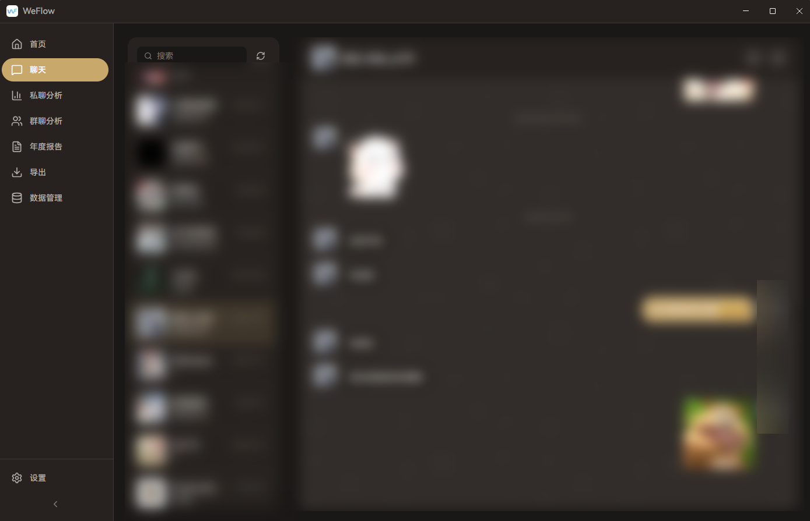

# WeFlow

WeFlow 是一个**完全本地**的微信聊天记录查看与分析工具，支持聊天检索、统计分析、群聊画像与年度报告。所有数据均在本地处理，不会上传到任何服务器。

---

<p align="center">
  
</p>

---

<p align="center">
<a href="https://github.com/hicccc77/WeFlow/stargazers">

</a>
<a href="https://github.com/hicccc77/WeFlow/network/members">

</a>
<a href="https://github.com/hicccc77/WeFlow/issues">

</a>
<a href="https://github.com/hicccc77/WeFlow/blob/main/LICENSE">

</a>
</p>

## 主要功能

- 本地查看与搜索聊天记录
- 统计分析与群聊画像
- 年度报告与可视化概览
- 导出聊天记录为 HTML 等格式
- 本地解密与数据库管理

## 快速开始

若你只想使用成品版本，可前往 Release 下载并解压运行。

## 面向开发者

如果你想从源码构建或为项目贡献代码，请遵循以下步骤：

```bash
# 1. 克隆项目到本地
git clone https://github.com/hicccc77/WeFlow.git
cd WeFlow

# 2. 安装项目依赖
npm install

# 3. 运行应用（开发模式）
npm run dev

# 4. 打包可执行文件
npm run build
```

打包产物在 `release` 目录下。

## 技术栈

- **前端**: React 19 + TypeScript + Zustand
- **桌面**: Electron 39
- **构建**: Vite + electron-builder
- **数据库**: better-sqlite3 + WCDB DLL
- **样式**: SCSS + CSS Variables

## 项目结构

```
WeFlow/
├── electron/              # Electron 主进程
│   ├── main.ts           # 主进程入口
│   ├── preload.ts        # 预加载脚本
│   └── services/         # 后端服务
│       ├── chatService.ts      # 聊天数据服务
│       ├── wcdbService.ts      # 数据库服务
│       ├── decryptService.ts   # 解密服务
│       └── ...
├── src/                   # React 前端
│   ├── components/       # 通用组件
│   ├── pages/            # 页面组件
│   ├── stores/           # Zustand 状态管理
│   ├── services/         # 前端服务
│   └── types/            # TypeScript 类型定义
├── public/               # 静态资源
└── resources/            # 打包资源
```

## 注意事项

- 仅支持 Windows 系统
- 需要微信 4.x 版本
- 所有数据仅在本地处理，不会上传到任何服务器
- 请负责任地使用本工具，遵守相关法律法规
